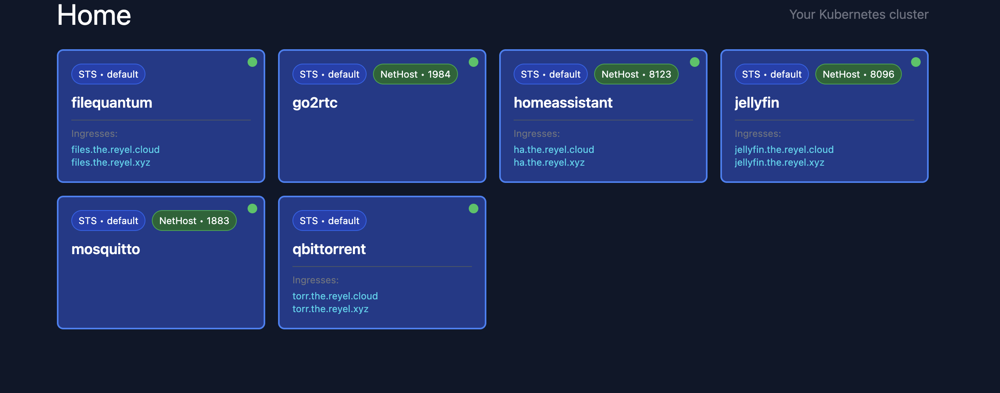
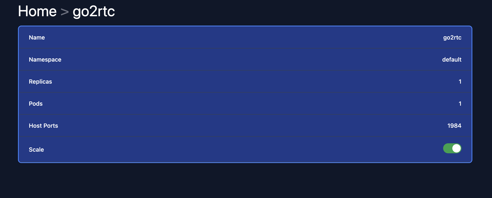

# k8s-home

A home dashboard for your Kubernetes cluster

## Requirements

- access to kubeconfig (locally) or service account (in cluster)
- deployments or statefulsets must have annotation `scaler.reyel.cloud/enabled: "true"`


## Usage

Deploy the following manifest

```yaml
---
apiVersion: v1
kind: ServiceAccount
metadata:
  name: k8s-home
  namespace: default

---
apiVersion: rbac.authorization.k8s.io/v1
kind: ClusterRole
metadata:
  name: k8s-home-role
rules:
  - apiGroups: ["apps"]
    resources: ["deployments", "statefulsets"]
    verbs: ["get", "list", "update"]
  - apiGroups: [""]
    resources: ["services"]
    verbs: ["get", "list"]
  - apiGroups: ["networking.k8s.io"]
    resources: ["ingresses"]
    verbs: ["get", "list"]

---
apiVersion: rbac.authorization.k8s.io/v1
kind: ClusterRoleBinding
metadata:
  name: k8s-home-binding
roleRef:
  apiGroup: rbac.authorization.k8s.io
  kind: ClusterRole
  name: k8s-home-role
subjects:
  - kind: ServiceAccount
    name: k8s-home
    namespace: default

---
apiVersion: apps/v1
kind: Deployment
metadata:
  name: k8s-home
spec:
  strategy:
    type: Recreate
  selector:
    matchLabels:
      app: k8s-home
  template:
    metadata:
      labels:
        app: k8s-home
    spec:
      serviceAccountName: k8s-home
      containers:
      - name: k8s-home
        image: ghcr.io/felipereyel/k8s-home:latest
        env:
        - name: USE_SA
          value: "true"
        - name: PORT
          value: "3000"

```

## Screens

### Home


### Details

